# CI/CD Pipeline Documentation – Flask Web Application
## 1. Introduction
This document describes the design and operation of a CI/CD pipeline for a Flask web application. CI/CD stands for Continuous Integration and Continuous Deployment. The goal of this pipeline is to automate the development process, detect errors early, and deliver secure and stable software.

This pipeline is implemented using Gitea Actions and consists of multiple stages such as code formatting, testing, security checks, containerization, and deployment.

-----
## 2. Pipeline Overview
The pipeline is automatically triggered with every push to the main branch:
### 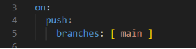
###
### Pipeline Schema
[Push to main]\
`        `↓\
[Format & Auto-fix]\
`        `↓\
[Test & Verify]\
`        `↓\
[Build + Scan + Push Docker Image]\
`        `↓\
[Deploy via SSH]

The pipeline consists of four main stages: 1. Format and Auto-fix 2. Test and Verify 3. Build, Scan and Push Image 4. Deployment

-----

## 3. Step 1: Code Formatting (Ruff)
In this stage, the code formatting is automatically checked and automatically corrected.
### Key code fragment:
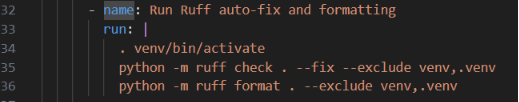

Ruff ensures that:

- Code remains consistent
- Errors are automatically fixed and pushed to the repository
- The codebase becomes more readable

If changes are detected, they are automatically committed:

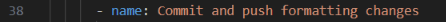

Venv is excluded from the linting check because when a new push is being made, it would have to start all over again. It also adds a lot of unnecessary work to the pipeline which results in a higher execution time.

-----
## 4. Step 2: Secrets scanning
This stage validates the security of the application by looking for hardcoded plain-text secrets like API-tokens, passwords or private keys. 

### 4.1 Secret Scanning (Gitleaks)
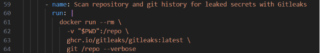

### 4.2 Unit Testing (Pytest)
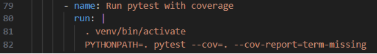

- Tests core functionality of the website by running assertions on the core functions that are being used by the website.
- Measures code coverage

### 4.3 Fuzz Testing
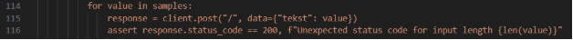

Fuzz testing sends unexpected input such as:

- Special characters
- Long strings
- Null strings
- Random data

This helps to:

- Prevent crashes
- Detect security vulnerabilities

### 4.4 Dependency Scanning (pip-audit)
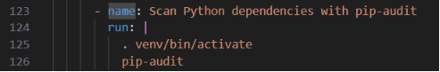

Checks for vulnerabilities in Python dependencies like Flask, OS, Time, Request

### 4.5 Smoke Test
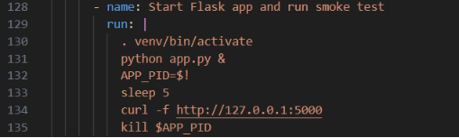

This step verifies that the application is running correctly. We do this check early in the pipeline to prevent spending a lot of time building a docker image that doesn’t work.

-----
## 5. Step 3: Docker Build and Security

### 5.1 Docker Image Build
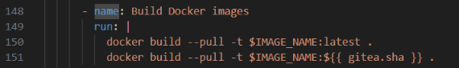

The application is packaged into a docker image with the help of a Dockerfile. As a base we are using ubuntu:latest.

### 5.2 Image Security Scan (Trivy)
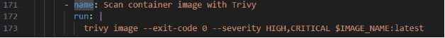

Detects vulnerabilities in the image. This test is different from the dependency test that ran earlier: This is a scan that is being done ‘Operating System’ wide.

### 5.3 Push to Registry
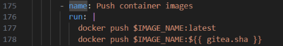

The image is stored in the Gitea image registry with the tag “Latest”. This tag is necessary for the rollback process. We need to differentiate between the “Stable” and “Latest” release.

-----
## 6. Step 4: Deployment
Deployment is performed automatically via SSH. The username and password are stored securely in the Gitea Secrets manager.

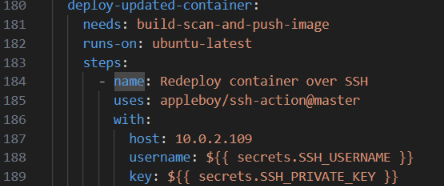

Docker Compose is used to shut down any container versions that are up: either a ‘stable’ or a ‘latest’ release.

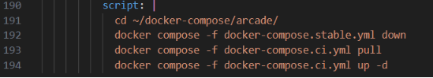

This ensures that the latest version of the application is being started up.

## 9. ChatOps with Telegram
We made a Python script that runs a Telegram bot. Whenever a new push is being made to the repository, the bot notifies us on our mobile phone with the following message:

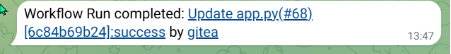

This allows us to know that a new deployment is being done soon. The bot also allows us to run two commands. /status fetches the status of the Docker container with the label ‘latest’. 

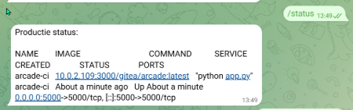

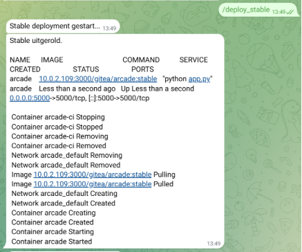The second command that can be used is /deploy\_stable. This command can be used if the deployment of a new ‘latest’ release makes it through the pipeline but still does not function correctly. It shuts down the ‘latest’ container with a docker compose command and deploys the ‘stable’ version of the website.

## 10\. Monitoring with Netdata
The machine that runs the docker container also runs a Netdata container. This allows the administrator to check on the system health like CPU use, page faults, disk I/O and so forth. Netdata can also detect anomalies in the system use which can be helpful to detect failures in the continuity of the website. The dashboard can be easily accessed with a web browser.

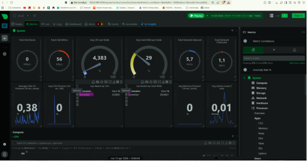

## 11\. Further improvements
There are several CI/CD pipeline elements that were shown during the class presentation in third week of this course that would be a good addition to the pipeline in its current form. The automatic security report that Cas made was impressive. Also, a final health check after deployment is also a great addition for a mature pipeline.

We have spent a lot of time on the ChatOps component. In hindsight we would have spent the time on a subject that would give the pipeline a more professional take. However: Being able to request the status of the website by checking telegram. We can see a clear use case for a rollback through telegram if a dysfunctional website has been deployed.

High availability infrastructure with the help of Kubernetes was also on the table. Unfortunately, we lack the experience to apply the ‘dark arts’ of Kubernetes. We have tried to set up a small cluster in a Proxmox environment but we could not figure out how to apply our image to the cluster. Also, working with Traefik was a real pain. 

Another mention of a possible upgrade would be to separate the services over different virtual machines or containers. We currently run Gitea, Gitea Runner, Netdata, Telegram bot and the website on the same host. In a production environment you don’t want to do this because it creates a single point of failure (SPOF).

## 12\. Conclusion
The CI/CD pipeline automates the entire process from development to deployment. This leads to faster detection of errors, improved security, and more reliable software delivery. The combination of testing, security, and automation makes this pipeline robust and professional.

## 13. Appendices
\- You can find a zipped version of the repository right [here](https://github.com/aCiDcHaOZ/DevSecOps).

\- The video that shows the pipeline being run is available [here](https://studio.youtube.com/video/sjNLOrZcqL8/edit).
